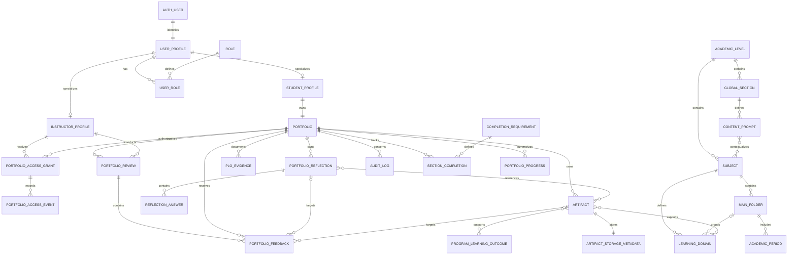

# Complete System Entity Relationship Diagram

```mermaid
erDiagram
  AUTH_USER ||--|| USER_PROFILE : identifies
  USER_PROFILE ||--o| STUDENT_PROFILE : specializes
  USER_PROFILE ||--o| INSTRUCTOR_PROFILE : specializes
  USER_PROFILE ||--o{ USER_ROLE : has
  ROLE ||--o{ USER_ROLE : defines
  STUDENT_PROFILE ||--|| PORTFOLIO : owns
  INSTRUCTOR_PROFILE ||--o{ PORTFOLIO_ACCESS_GRANT : receives
  PORTFOLIO ||--o{ PORTFOLIO_ACCESS_GRANT : authorizes
  PORTFOLIO_ACCESS_GRANT ||--o{ PORTFOLIO_ACCESS_EVENT : records
  ACADEMIC_LEVEL ||--o{ SUBJECT : contains
  SUBJECT ||--o{ MAIN_FOLDER : contains
  MAIN_FOLDER ||--o{ ACADEMIC_PERIOD : includes
  SUBJECT ||--o{ LEARNING_DOMAIN : defines
  MAIN_FOLDER o|--o{ LEARNING_DOMAIN : groups
  ACADEMIC_LEVEL ||--o{ GLOBAL_SECTION : contains
  CONTENT_PROMPT }o--o{ SUBJECT : contextualizes
  GLOBAL_SECTION ||--o{ CONTENT_PROMPT : defines
  PORTFOLIO ||--o{ PORTFOLIO_REFLECTION : owns
  PORTFOLIO_REFLECTION ||--o{ REFLECTION_ANSWER : contains
  PORTFOLIO ||--o{ ARTIFACT : owns
  ARTIFACT ||--|| ARTIFACT_STORAGE_METADATA : stores
  PORTFOLIO_REFLECTION }o--o{ ARTIFACT : references
  ARTIFACT }o--o{ LEARNING_DOMAIN : supports
  ARTIFACT }o--o{ PROGRAM_LEARNING_OUTCOME : supports
  PORTFOLIO ||--o{ PLO_EVIDENCE : documents
  PORTFOLIO ||--o{ PORTFOLIO_REVIEW : receives
  INSTRUCTOR_PROFILE ||--o{ PORTFOLIO_REVIEW : conducts
  PORTFOLIO_REVIEW ||--o{ PORTFOLIO_FEEDBACK : contains
  PORTFOLIO ||--o{ PORTFOLIO_FEEDBACK : receives
  PORTFOLIO_REFLECTION o|--o{ PORTFOLIO_FEEDBACK : targets
  ARTIFACT o|--o{ PORTFOLIO_FEEDBACK : targets
  PORTFOLIO ||--o{ AUDIT_LOG : concerns
  PORTFOLIO ||--o{ SECTION_COMPLETION : tracks
  COMPLETION_REQUIREMENT ||--o{ SECTION_COMPLETION : defines
  PORTFOLIO ||--o{ PORTFOLIO_PROGRESS : summarizes
```

`AUTH_USER` is managed by Supabase Auth. The access grant is the only relationship that authorizes instructor portfolio access.
