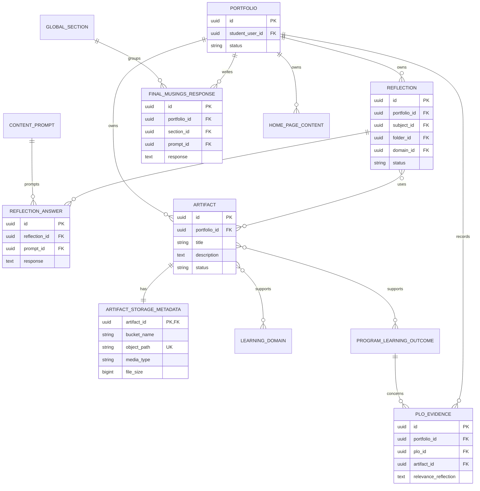

# Portfolio Content ERD

## Phase 4 – Stage 2

```mermaid
erDiagram
    PORTFOLIO ||--o{ REFLECTION : owns
    REFLECTION ||--o{ REFLECTION_ANSWER : contains
    CONTENT_PROMPT ||--o{ REFLECTION_ANSWER : prompts
    REFLECTION }o--o{ ARTIFACT : uses
    PORTFOLIO ||--o{ ARTIFACT : owns
    ARTIFACT ||--|| ARTIFACT_STORAGE_METADATA : has
    ARTIFACT }o--o{ LEARNING_DOMAIN : supports
    ARTIFACT }o--o{ PROGRAM_LEARNING_OUTCOME : supports
    PORTFOLIO ||--o{ PLO_EVIDENCE : records
    PROGRAM_LEARNING_OUTCOME ||--o{ PLO_EVIDENCE : concerns
    PORTFOLIO ||--o{ FINAL_MUSINGS_RESPONSE : writes
    GLOBAL_SECTION ||--o{ FINAL_MUSINGS_RESPONSE : groups
    PORTFOLIO ||--o{ HOME_PAGE_CONTENT : owns

    PORTFOLIO {
        uuid id PK
        uuid student_user_id FK
        string status
    }
    REFLECTION {
        uuid id PK
        uuid portfolio_id FK
        uuid subject_id FK
        uuid folder_id FK
        uuid domain_id FK
        string status
    }
    REFLECTION_ANSWER {
        uuid id PK
        uuid reflection_id FK
        uuid prompt_id FK
        text response
    }
    ARTIFACT {
        uuid id PK
        uuid portfolio_id FK
        string title
        text description
        string status
    }
    ARTIFACT_STORAGE_METADATA {
        uuid artifact_id PK, FK
        string bucket_name
        string object_path UK
        string media_type
        bigint file_size
    }
    PLO_EVIDENCE {
        uuid id PK
        uuid portfolio_id FK
        uuid plo_id FK
        uuid artifact_id FK
        text relevance_reflection
    }
    FINAL_MUSINGS_RESPONSE {
        uuid id PK
        uuid portfolio_id FK
        uuid section_id FK
        uuid prompt_id FK
        text response
    }
```

One artifact is stored once and linked through junction relationships. PLO evidence is documentation, not automatic attainment.
